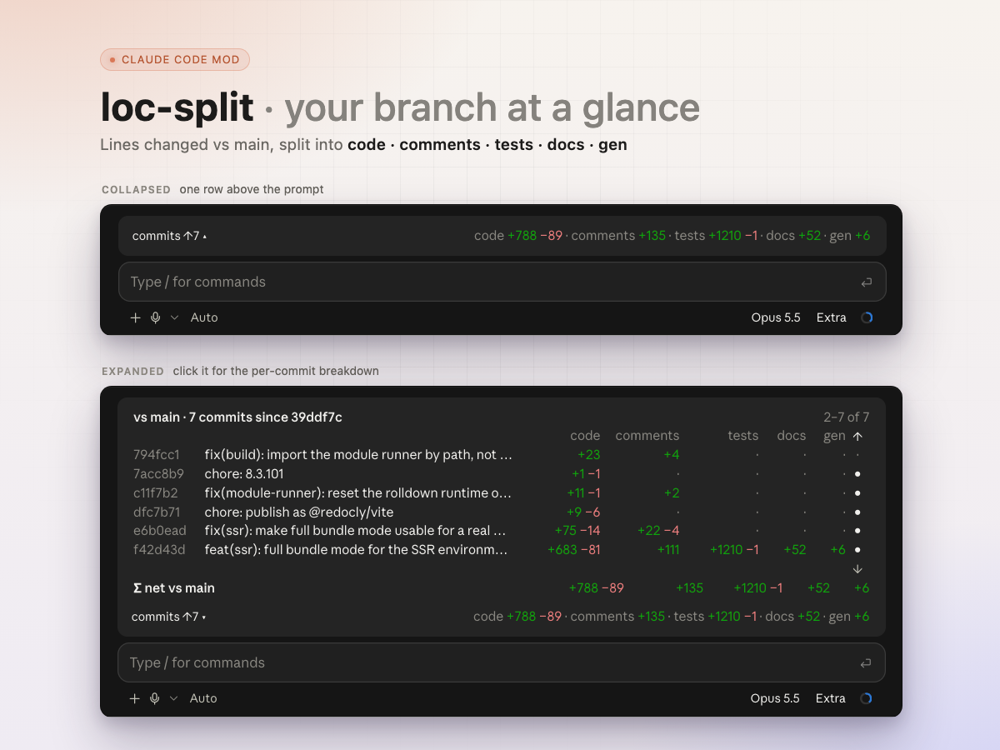

# loc-split

A [Claude Code mod](https://claude.dev/blog/getting-started-with-claude-code-mods/) that shows what your branch changed against `main`, split into **code**, **comments**, **tests**, **docs** and **gen** (generated files), in a row right above the prompt.



```
commits ↑7 ▴              code +788 −89 · comments +135 · tests +1210 −1 · docs +52 · gen +6
```

Click `commits ↑7` (or type `/loc-split`) to open the per-commit table above it: every commit since the branch left `main`, your uncommitted changes, and the net total. The list scrolls on its own when it is long; the totals and the row stay put.

## What it counts

The numbers are lines added and removed between the merge base with `main` and your working tree, untracked files included. The base is the first of `origin/main`, `main`, `origin/master`, `master` that exists, then whatever `origin/HEAD` points at.

| Category | Files |
| --- | --- |
| **tests** | `*.test.*`, `*.spec.*`, `*_test.go`, `test_*.py`, `*Test.java`, `*_spec.rb`, and anything under `tests/`, `__tests__/`, `spec/`, `e2e/`, `fixtures/`, … |
| **docs** | `.md`, `.mdx`, `.rst`, `.txt`, `.adoc`, README / CHANGELOG / LICENSE, and anything under `docs/` |
| **gen** | lockfiles (npm, pnpm, yarn, bun, Cargo, Poetry, uv, `go.sum`, …), Drizzle `meta/*_snapshot.json` and `_journal.json`, Jest `.snap`, `*.gen.*`, `*.generated.*`, `__generated__/`, protobuf and Dart codegen, minified bundles and source maps |
| **code** / **comments** | everything else, each changed line sorted by whether it is a comment |

Comments are told apart per language: `//` and `/* */` (JSDoc `*` lines included) for the C family, JS/TS, Go, Rust, Java, Swift, CSS and the like; `#` for Python, Ruby, shell, YAML, TOML; Python docstrings; `--` for SQL, Lua and Haskell; `<!-- -->` for HTML, XML, Vue and Svelte. A line with code before its comment counts as code.

Generated files are counted with `git diff --numstat`, so a large lockfile change costs nothing to measure, and they are left out of the comment analysis entirely.

Categories with no changed lines are left off the row. When the band is narrow the row drops the word "commits", then shortens the labels (`cmt`, `test`, `doc`), then shows added lines only.

## When it refreshes

When the session starts, a moment after Claude edits a file or runs a command, at the end of every turn, and every 20 seconds, so commits you make in your own terminal show up too.

## Install

### Claude desktop app

1. Open **Settings**.
2. Type `plugins` and press Enter.
3. In the top right corner, click **Add**.
4. Enter `RomanHotsiy/claude-mods` and click **Sync**.
5. You should now see **Loc split** in the list.

### Claude Code in a terminal

```
/plugin marketplace add RomanHotsiy/claude-mods
/plugin install loc-split@claude-mods
/reload-plugins
```

The row shows in any session whose working directory is a git repository with a `main` or `master` branch.

## What it runs, reads and sends

A mod is code that runs inside Claude Code on your machine, with the same access Claude Code has; read the source before you install one. This one is four files under [`hooks/`](hooks): `register.ts` (the hooks, and every call it makes), `band.tsx` (the drawing), `split.ts` (sorting lines) and `commands.ts` (the git command lines).

**Sends: nothing.** It makes no network calls, and nothing it reads leaves your machine. The model sees nothing from it either, apart from the one line `/loc-split` prints when the session is not in a git repository with a `main` or `master` branch. It writes no files: what it measures is kept in the session's memory and drawn in the band above the prompt.

**Runs: `git`, read-only, in your repository.** Every call is in one function, `refresh` in [`hooks/register.ts`](hooks/register.ts); the commands that print paths are built in [`hooks/commands.ts`](hooks/commands.ts) and go through `git -c core.quotePath=false`, so paths with non-ASCII names come back as written:

| Command | Why |
| --- | --- |
| `git rev-parse --show-toplevel` | find the repository root |
| `git symbolic-ref --quiet --short refs/remotes/origin/HEAD` | the remote's default branch, the last fallback for the base |
| `git rev-parse --verify --quiet <ref>^{commit}` | which of `origin/main`, `main`, `origin/master`, `master` exists |
| `git merge-base HEAD <base>` | where your branch left `main` |
| `git log --no-merges --max-count=50 --format=%H%x1f%s <merge-base>..HEAD` | the commits to list |
| `git log --no-merges --max-count=50 -p -U0 -M … <merge-base>..HEAD -- :/ <excludes>` | each commit's changed lines, to sort into code, comments, tests and docs |
| `git log --no-merges --max-count=50 --numstat --no-renames … -- <generated files>` | each commit's line counts for generated files |
| `git rev-list --no-merges --count <merge-base>..HEAD` | how many commits are ahead |
| `git diff -U0 -M … HEAD -- :/ <excludes>` and `git diff --numstat --no-renames … HEAD -- <generated files>` | uncommitted changes |
| `git diff -U0 -M … <merge-base> -- :/ <excludes>` and `git diff --numstat --no-renames … <merge-base> -- <generated files>` | the net change against `main` |
| `git ls-files --others --exclude-standard -z` | untracked files, which count as added |

`<excludes>` and `<generated files>` are the same list of generated-file globs from the table above, as `:(top,exclude,glob)` and `:(top,glob)` pathspecs.

**Reads:** the output of those commands, and the text of untracked files (up to 500, through Claude Code's file access) to count their lines.

**Hooks:**

| Event | What it does |
| --- | --- |
| `session.start` | registers `/loc-split`, measures once, and starts a 20-second refresh timer |
| `tool.call` | lets every tool call through unchanged; after an `Edit`, `MultiEdit`, `Write`, `NotebookEdit` or `Bash` call finishes it schedules a refresh. It never reads or changes the call's input or result |
| `turn.complete` | schedules a refresh |
| `command.run` for `/loc-split` | opens or closes the per-commit table |
| `ui.render` for `AbovePrompt` | draws the row and the table in the band above the prompt; it steps aside while a survey uses the band |

It reads nothing from the conversation: no prompts, no replies, no tool output.

## Develop

```
claude --plugin-dir ./loc-split
claude plugin validate ./loc-split
claude plugin test ./loc-split
```

`tests/fixture.ts` holds git output recorded from a small scratch repository, so the test runs without git.
